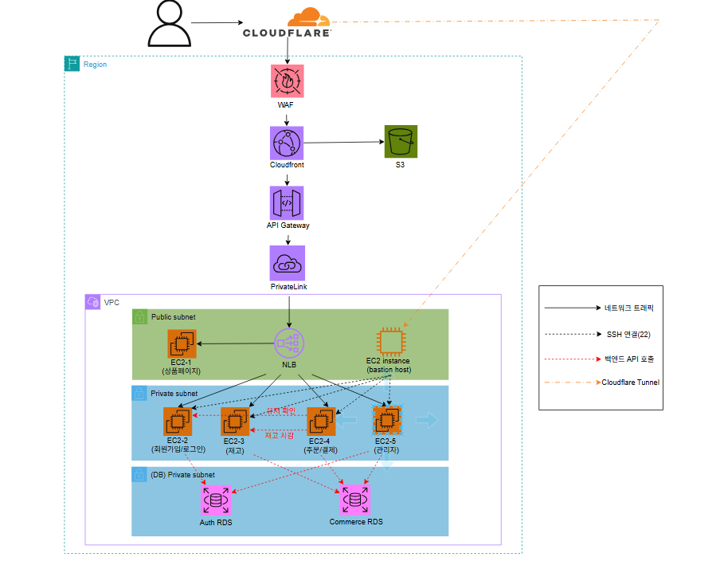

# 🦫 Woowa Beavers Shop

> Woowa Beavers Shop은 CERT 운영을 목적으로 설계된 MSA 기반 쇼핑몰 서비스입니다. AWS 네이티브 보안 서비스(GuardDuty, CloudTrail, Security Hub 등)와 SIEM 연동을 고려한 로깅 및 모니터링 구조를 갖(출 예정에) 있으며, 실제 서비스 환경에서 발생하는 보안 이벤트를 탐지·분석·대응하는 실습 환경으로 활용됩니다.

---

## 🛠 기술 스택

| 구분 | 기술 |
|------|------|
| Frontend | 바닐라 JS + Jinja2 |
| Backend | FastAPI (Python) |
| Database | AWS RDS (PostgreSQL) x 2 |
| Infra | AWS EC2 x 5 |
| IaC | Terraform |
| CI/CD | GitHub Actions |
| Container | Docker + Docker Compose |
| CDN | AWS CloudFront + S3 |
| DNS / 보안 | Cloudflare |

---

## 🏗 아키텍처


---
### 서버 구성

| 서버 | 역할 | 연결 DB |
|------|------|---------|
| EC2-1 | 상품 조회 (유저용) | Commerce RDS |
| EC2-2 | 회원가입 / 로그인 | Auth RDS |
| EC2-3 | 재고 처리 | Commerce RDS |
| EC2-4 | 주문 / 결제 | Commerce RDS |
| EC2-5 | 관리자 | Commerce RDS |

---

## 📁 디렉토리 구조

```
woowa-beavers-shop/
├── services/
│   ├── product/          # EC2-1: 상품 조회
│   │   ├── app/
│   │   │   ├── main.py
│   │   │   ├── routers/
│   │   │   ├── models/
│   │   │   ├── schemas/
│   │   │   ├── templates/    # Jinja2 HTML
│   │   │   └── static/       # 바닐라 JS, CSS
│   │   ├── Dockerfile
│   │   └── requirements.txt
│   ├── auth/             # EC2-2: 회원/로그인
│   ├── inventory/        # EC2-3: 재고
│   ├── order/            # EC2-4: 주문/결제
│   └── admin/            # EC2-5: 관리자
├── shared/               # 서비스간 공통 코드
│   ├── clients/
│   │   ├── auth_client.py
│   │   ├── inventory_client.py
│   │   └── order_client.py
│   └── utils/
├── infra/terraform/      # Terraform IaC
└── docker-compose.yml    # 로컬 개발용
```

---

## 💬 커밋 컨벤션

```
<type>(<scope>): <subject>
```

### 타입

| 타입 | 설명 |
|------|------|
| `feat` | 새 기능 추가 |
| `fix` | 버그 수정 |
| `chore` | 설정, 패키지, 기타 |
| `docs` | 문서 수정 |
| `style` | 코드 포맷 |
| `refactor` | 리팩토링 |
| `test` | 테스트 코드 |
| `ci` | CI/CD 설정 |

### 예시

```
feat(auth): 회원가입 API 구현
fix(product): 상품 목록 페이지네이션 오류 수정
chore(docker): docker-compose 설정 추가
docs(bastion): SSH 접속 가이드 작성
ci(github): 배포 워크플로우 추가
```

---

## 🌿 브랜치 전략

```
main
├── ksy
├── kjm
├── ann
└── yjw
```

- 각 팀원은 본인 브랜치에서 작업
- 작업 완료 후 `main` 브랜치로 PR
- 최소 1명 이상 코드 리뷰 후 머지

---

## 🚀 로컬 실행 방법

### 사전 준비

- Docker, Docker Compose 설치
- `.env` 파일 설정 (팀장에게 문의)

### 전체 서비스 실행

```bash
git clone https://github.com/woowa-beavers/woowa-beavers-shop
cd woowa-beavers-shop
docker-compose up -d
```

### 특정 서비스만 실행

```bash
docker-compose up -d product
docker-compose up -d auth
```

### 서비스 URL

| 서비스 | URL |
|--------|-----|
| 상품 | http://localhost:8001 |
| Auth | http://localhost:8002 |
| 재고 | http://localhost:8003 |
| 주문/결제 | http://localhost:8004 |
| 관리자 | http://localhost:8005 |

---

